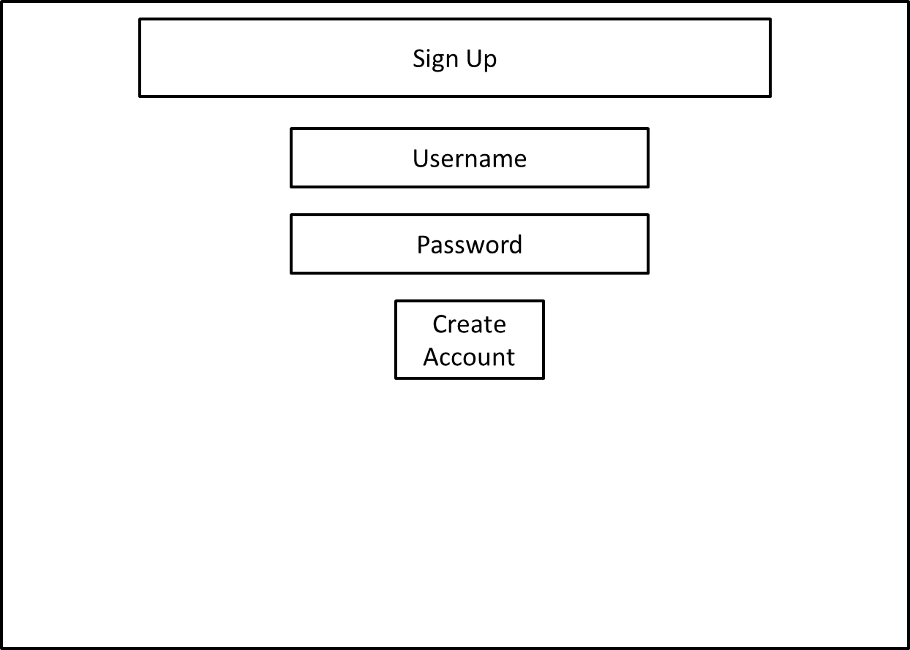
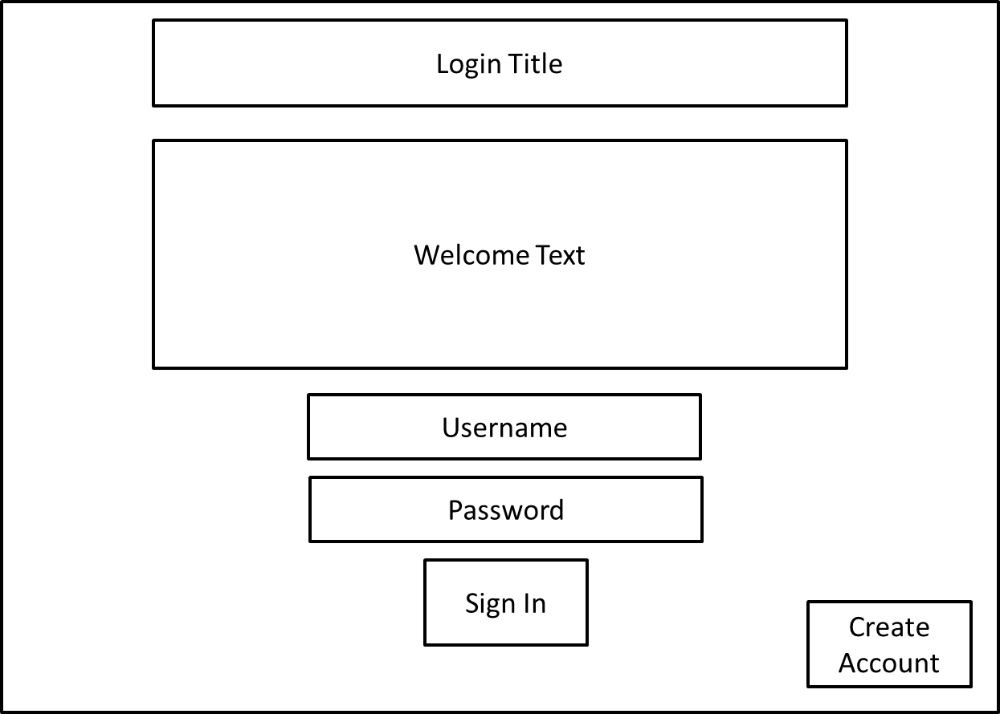
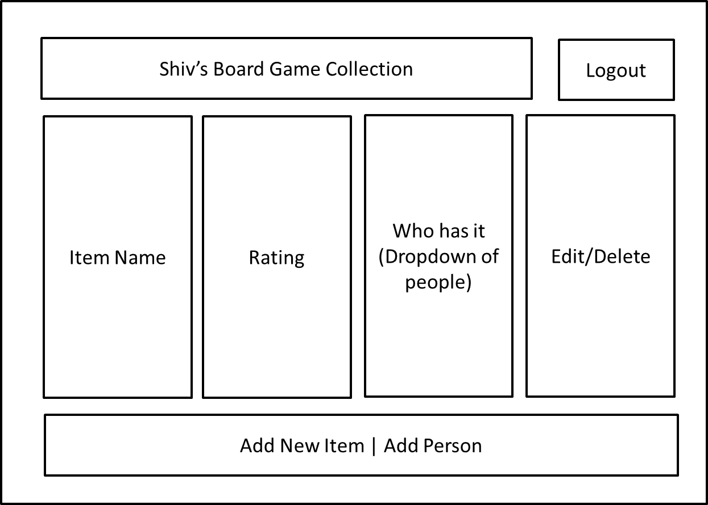

# Library Management System:

## Process Model

Client | | Browser | | Server
---| --- |--- |--- | ---
Listen | | | | 
===> | Run `node app.js` | ===> | LISTEN request | ===>
<===| Console log port number | <=== | Port number found | <===
Render | | | | 
===> | Render `/library/:user` | ===> | GET request | ===>
<===| Render HTML | <=== | Render `login.ejs` | <===
| | | | 
===> | Correct user details from `/login` | ===> | GET request | ===>
<===| Render HTML | <=== | Response HTML `libray.ejs` | <===
 | | | | 
===> | Render `/register` | ===> | GET request | ===>
<===| Render HTML | <=== | Render `new-admin.ejs` | <===
| | | | 
Redirect | | | | 
===> | Render `/` | ===> | Redirect to `/login` | ===>
 | | | |
===> | Incorrect admin login | ===> | Redirect to `login` | ===>
 | | | |
 ===> | Render `/library/user` (no login) | ===> | Redirect to `/login` | ===>
  | | | |
   ===> | Logout | ===> | End Session and `/login` | ===>
  | | | |
Post | | | | 
===> | New User Created | ===> | POST request | ===>
<===| Render HTML | <=== | Respond HTML `/library` | <===
| | | | 
===> | New Person Added | ===> | POST request | ===>
<===| Render HTML | <=== | Respond HTML `/library` | <===
| | | | 
===> | New Item Added | ===> | POST request | ===>
<===| Render HTML | <=== | Respond HTML `/library` | <===
| | | | 
Edit | | | 
 | | | |
Delete | | |
| | | | 

## Database Schema

### Admins
Responsibilities | Collaborators
--- | ---
id | 
Username | 
Password | 

### People
Responsibilities | Collaborators
--- | ---
id | 
Username | 

### Items
Responsibilities | Collaborators
--- | ---
id | 
Name | 
AdminId | 
PersonId | 

## Mock-Up

